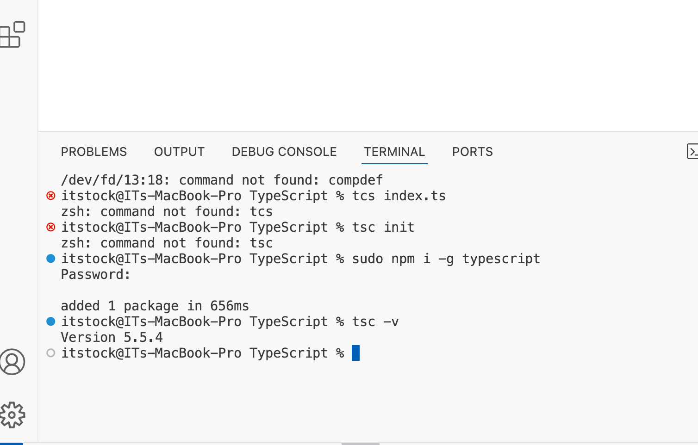

> ts is nothing but js + type
> in ts we can find all the mistake in compile time it self {for example we declared a number variable andd gave it type as string . Now if we do round function iit ts would error in compile type only }

hence due to this we need not perform special testing

# TS features

1.type checking 2. code completion
3.Refactoring

## Drawbacks

Browsers cant understand TS hence we give a compiler TS which will give JS as output this is called Transpilation

## installing TS

## Data types

Ts can by default anotate the type if the variable if the value is assigned ;
if the value is not assigned nor type is declared to variable then ts will consider it as any

to make all the error data types we use any like in .json file

